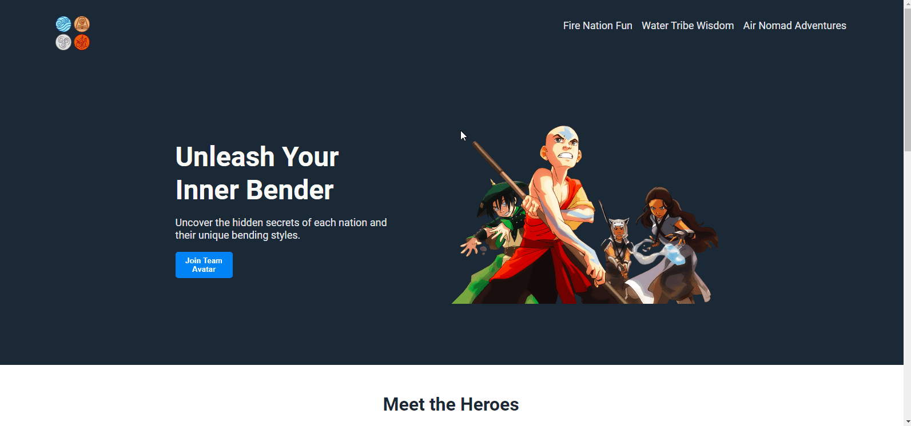

# Aangland



## Project Overview
A sample landing page inspired by [The Last Airbender](https://en.wikipedia.org/wiki/Avatar:_The_Last_Airbender). This project primarily demonstrates basic CSS tools and skills including common elements (e.g., color, font, and size), the box model (e.g., margin, border, and padding), and flexbox (e.g., alignment, centering, growing/shrinking).

## Tech/Framework Used
- HTML
- CSS
  
## Installation and Usage

1. **Clone the Repository:**

   ```bash
     git clone git@github.com:aaelsay3d/aangland.git
   ```
2. **Navigate to the Project Directory:**
   
   ```bash
     cd aangland
   ```
   
3. **Viewing the Website:**
   Open `index.html` in your web browser to view the main page.

## Credits and Acknowledgment
All images sourced from [pngegg.com](https://www.pngegg.com/en).

## License
This project is licensed under the [MIT License](./LICENSE).
